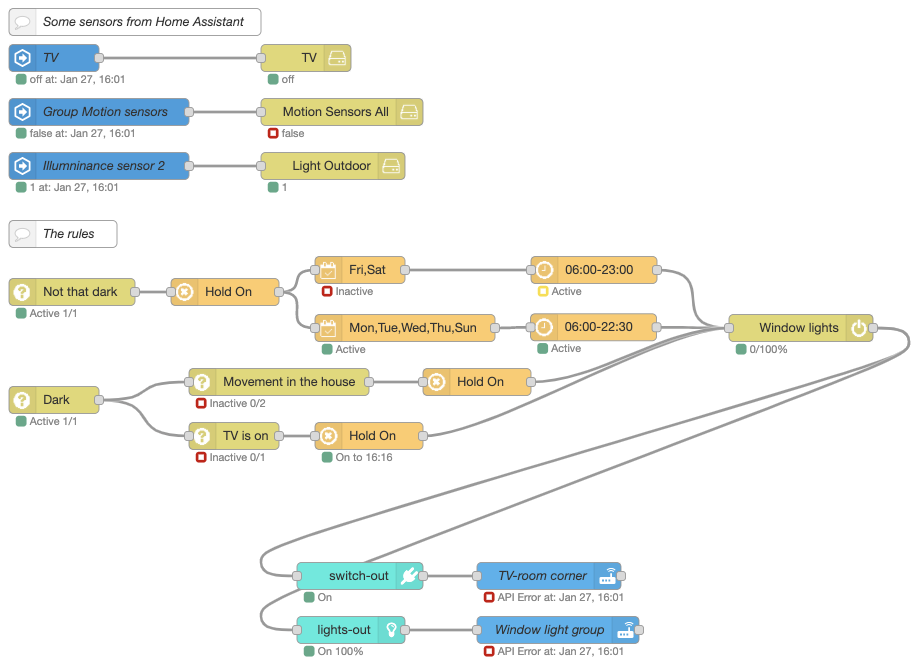

# node-red-contrib-norelite 

Try to implement this scenario through automation rules in Home Assistant:

**_I want the lights on if it is starting to get dark and it is Sun-Thu (workday the day after) between 6-22:30 OR Fri-Sat between 6-23. I also want the lights to be on if it is really dark and the TV is on. But if the TV is turned off I want the lights to stay on for another 15 mins. And if I wake up and need to go to the restroom during the night I want the lights to turn on for 10 mins._**

So in summary:
- It is starting to get dark outside, keep lights on for min 30 mins to avoid frequent switch on/off actions AND
    - Day is Fri-Sat
        - Time is 06:00 - 23:00
    - OR Day is Sun-Mon
        - Time is 06:00 - 22:30
- OR it is really dark outside AND
    - The TV is on
    - OR The TV is turned off but keep the lights on for another 15 mins
    - OR Motion is detected in the house and keep the lights on for 10 mins

It will probably take some work to build automation scripts in Home Assistant to accomplish but in Node-RED fairly simple to implement using node-red-contrib-norelite as illustrated below.

## So, what's the difference from using standard Node-RED nodes ##

In short I'd say it is the following main characteristics:
- **state management is built into the norelite nodes**
    - Node-RED as a basis is very event driven with doesn't normally keep states - this can of course be implemented using _flow_ or _context_ variables
- **a 'magic' node - the switch node - keeps track on all messages recieved and from which sender and calculates if a light should be turned on or off**
    - It is a complex task to manage if a light or a switch should be turned on or off if there are many rules such as in the example above
    - By default a light is off - can be set on by enabling _msg.payload.enabled_
    - The higest dim value will set the strength of the lights - _msg.payload.dim_
    - Values can be enforces by setting a priority. It can even be turned of if the incoming message is set with a higher priority - _msg.payload.type_
- **built in simple rules management defined by sensors or really any values**
    - Uses simple comparison to check on the stored values with fixed values or even compare with other sensors
- **plenty of ready to use utility nodes tailored for home automation**
    - Uses the same syntax as the core norelite nodes and enables traceability for receiver of sender
    - Filter by day or time
    - Change dim or light strength
    - Change color (uses the [node-red-contrib-norelite-color](https://www.npmjs.com/package/node-red-contrib-norelite-color) node)
    - Override values or enforce on/off based on incoming enabled
- **device nodes that converts the internal messaging to specific devices**
    - TRÅDFRI
    - RFXcom
    - OpenZwave
    - Home Assistant (switch and lights) ([node-red-contrib-norelite-home-assistant-websocket](https://www.npmjs.com/package/node-red-contrib-home-assistant-websocket))

## Alright, how do I get started? ##

1. Install the required dependencies into Node-RED based on what you want to do
    - Core package: [node-red-contrib-norelite](https://www.npmjs.com/package/node-red-contrib-norelite)
    - Change color node: [node-red-contrib-norelite-color](https://www.npmjs.com/package/node-red-contrib-norelite-color)
    - Translates instructions that are compliant for calls to your Home Assistant instance - [node-red-contrib-norelite-homeassistant](https://www.npmjs.com/package/node-red-contrib-norelite-homeassistant)
        - Helper nodes to be used with **node-red-contrib-norelite**  and [node-red-contrib-norelite-home-assistant-websocket](https://www.npmjs.com/package/node-red-contrib-home-assistant-websocket). 
2. Import examples that comes with the installation
    - Node-RED menU: Import > Examples > node-red-contrib-norelite
3. Read the node descriptions in the Node-RED GUI. I've tried to document them fairly well..